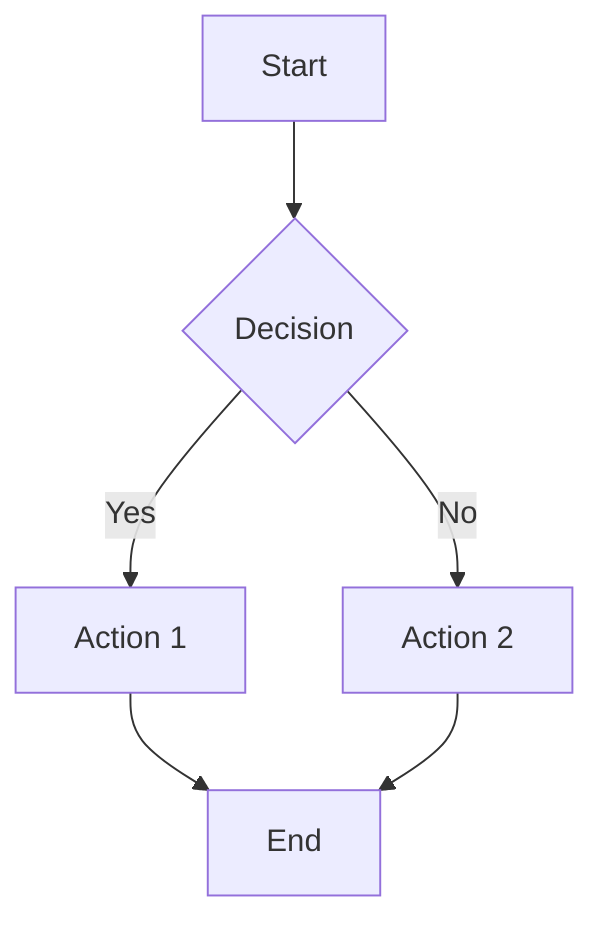

# Document Requirements Specification
## Q&A Game Platform v1.0

**Document Type:** Documentation Standards & Guidelines  
**Date Created:** June 2026  
**Status:** Active  
**Audience:** Development Team, Technical Writers, Documentation Maintainers  
**Version:** 1.0

---

## 📋 Table of Contents

1. [Executive Summary](#executive-summary)
2. [Documentation Framework](#documentation-framework)
3. [Document Categories & Standards](#document-categories--standards)
4. [Writing Standards](#writing-standards)
5. [Technical Documentation Standards](#technical-documentation-standards)
6. [Visual Documentation Standards](#visual-documentation-standards)
7. [Code Documentation Standards](#code-documentation-standards)
8. [Quality Assurance & Review](#quality-assurance--review)
9. [Documentation Maintenance](#documentation-maintenance)
10. [Tools & Technologies](#tools--technologies)
11. [Templates & Examples](#templates--examples)

---

## 🎯 Executive Summary

This document establishes comprehensive standards for all documentation within the Q&A Game Platform project. It ensures:
- Consistency across all documentation
- High quality and accuracy
- Easy navigation and discoverability
- Compliance with industry best practices
- Accessibility for all users
- Maintainability over time

All team members creating, updating, or reviewing documentation must adhere to these requirements.

---

## 🏗️ Documentation Framework

### Documentation Hierarchy

```
PROJECT DOCUMENTATION
│
├── 📘 SYSTEM-LEVEL DOCUMENTATION
│   ├── SYSTEM_ARCHITECTURE.md          (System design & structure)
│   ├── ENTITY_RELATIONSHIP_DIAGRAM.md  (Database schema & relationships)
│   ├── API_REFERENCE_COMPLETE.md       (Complete API documentation)
│   └── TECHNOLOGY_STACK.md             (Tech choices & justifications)
│
├── 📗 FEATURE-LEVEL DOCUMENTATION
│   ├── REQUIREMENTS.md                 (Functional & non-functional requirements)
│   ├── DOCUMENT_REQUIREMENTS.md        (This file - documentation standards)
│   ├── FEATURE_GUIDES/
│   │   ├── authentication-guide.md
│   │   ├── game-management-guide.md
│   │   ├── question-management-guide.md
│   │   └── dashboard-guide.md
│   └── INSTALLATION_GUIDE.md           (Setup & deployment)
│
├── 📕 DEVELOPER DOCUMENTATION
│   ├── CODE_STYLE_GUIDE.md             (Coding standards)
│   ├── API_DEVELOPMENT_GUIDE.md        (API development standards)
│   ├── COMPONENT_DEVELOPMENT_GUIDE.md  (React component standards)
│   ├── DATABASE_GUIDE.md               (Database operations)
│   └── TESTING_GUIDE.md                (Testing standards)
│
├── 📙 USER DOCUMENTATION
│   ├── QUICK_START.md                  (Getting started for new users)
│   ├── USER_MANUAL.md                  (Complete user guide)
│   ├── FAQ.md                          (Frequently asked questions)
│   ├── TROUBLESHOOTING.md              (Problem solving guide)
│   └── VIDEO_GUIDES.md                 (Video tutorial links)
│
├── 📔 OPERATIONAL DOCUMENTATION
│   ├── DEPLOYMENT_GUIDE.md             (Deployment procedures)
│   ├── MAINTENANCE_GUIDE.md            (System maintenance)
│   ├── BACKUP_RECOVERY_GUIDE.md        (Backup & disaster recovery)
│   ├── MONITORING_GUIDE.md             (System monitoring & alerting)
│   └── CHANGE_LOG.md                   (Version history & changes)
│
└── 📓 PROJECT MANAGEMENT DOCUMENTATION
    ├── PROJECT_ROADMAP.md              (Feature roadmap & timeline)
    ├── RELEASE_NOTES.md                (Version releases)
    ├── DECISION_LOG.md                 (Design decisions & rationale)
    └── LESSONS_LEARNED.md              (Post-project reflections)
```

### Documentation Storage

**Location**: Project root directory and subdirectories
```
q-and-a-game-platform/
├── *.md files (root level - critical docs)
├── docs/ (optional subdirectory for detailed guides)
├── docs/guides/
├── docs/api/
├── docs/architecture/
├── docs/deployment/
└── docs/user-guides/
```

**Version Control**: All documentation in Git repository
**Backup**: Include in regular database/code backups

---

## 📚 Document Categories & Standards

### Category 1: System Architecture Documentation

#### 1.1 SYSTEM_ARCHITECTURE.md

**Purpose**: Describe overall system design, components, and interactions

**Required Sections**:
- Executive Summary (150-250 words)
- System Overview with diagram
- Architecture Overview (with ASCII/visual diagram)
- Technology Stack table
- Database Schema (overview + ER diagram reference)
- API Architecture (endpoint categories)
- Security Architecture
- Frontend Architecture
- Backend Architecture
- Data Flow diagrams (2-4 major flows)
- Deployment Architecture
- Performance Metrics (targets, benchmarks)
- Future Enhancement Roadmap (5+ items)
- Technology Stack details (version numbers)

**Format Requirements**:
- Length: 3,000-5,000 words
- Diagrams: 3-5 ASCII/visual diagrams
- Code examples: 2-3 architecture patterns
- Update frequency: Quarterly (or on major changes)
- Review: 2 senior developers + architect

**Current Status**: ✅ Complete (SYSTEM_ARCHITECTURE.md)

---

#### 1.2 ENTITY_RELATIONSHIP_DIAGRAM.md

**Purpose**: Define database schema, relationships, and integrity rules

**Required Sections**:
- Executive Summary
- Visual EDA (ASCII diagram)
- Table Specifications (all 11+ tables):
  - Table name, purpose, columns, sample data
  - Primary keys, foreign keys, constraints
  - Indexes and performance considerations
- Relationship Specifications (one-to-many, many-to-one)
- Cardinality Summary table
- Key/Index Specifications
- Data Integrity Rules (constraints)
- Data Volume Estimates (small, medium, large systems)
- View Suggestions (useful database views)

**Format Requirements**:
- Length: 2,000-3,000 words
- Diagrams: 1-2 main ER diagrams + table layouts
- Code examples: SQL CREATE TABLE statements
- Update frequency: Quarterly (or on schema changes)
- Review: Database architect + senior backend dev

**Current Status**: ✅ Complete (ENTITY_RELATIONSHIP_DIAGRAM.md)

---

#### 1.3 API_REFERENCE_COMPLETE.md

**Purpose**: Complete API endpoint documentation with examples

**Required Sections**:
- Table of Contents (auto-generated from headers)
- Authentication APIs (login, signup, password reset)
- Game Management APIs (CRUD + special operations)
- Round Management APIs (CRUD)
- Question Management APIs (CRUD + bulk operations)
- Question Type Configuration APIs (CRUD)
- Dashboard & Analytics APIs (statistics endpoints)
- User Management APIs (admin operations)
- Permissions APIs (grant, revoke, view)
- Activity Log APIs
- Game Answer APIs

**Per-Endpoint Requirements**:
- Endpoint path and method (GET, POST, PUT, DELETE)
- Purpose (1-2 sentences)
- Use cases (bullet list)
- Query parameters (with descriptions)
- Request body (JSON with field descriptions)
- Response (200, 400, 401, 404, 500 examples)
- Validation rules
- Business logic explanation
- Authorization requirements
- Error responses with codes

**Format Requirements**:
- Length: 5,000-8,000 words
- Code examples: 40-50 JSON examples
- Diagrams: 1-2 API flow diagrams
- Update frequency: Per API change (immediate)
- Review: 2 backend developers
- Tool support: Postman collection export

**Current Status**: ✅ Complete (API_REFERENCE_COMPLETE.md - 1557 lines)

---

### Category 2: Requirements Documentation

#### 2.1 REQUIREMENTS.md

**Purpose**: Define functional and non-functional requirements

**Required Sections**:
- Executive Summary
- System Overview
- Functional Requirements (organized by feature)
- Non-Functional Requirements (performance, security, scalability)
- Use Cases (detailed scenarios)
- Constraints & Assumptions
- Glossary of terms

**Per-Requirement Structure**:
- User Story format (As a..., I want..., so that...)
- Acceptance Criteria (testable conditions)
- Validation Rules
- Error Handling
- Related requirements cross-references

**Format Requirements**:
- Length: 4,000-7,000 words
- Diagrams: 2-3 flow diagrams
- Use cases: 5-10 detailed scenarios
- Tables: Comparison tables for options
- Update frequency: Quarterly
- Review: Product owner + 2 developers
- Traceability: Link to design & implementation

**Current Status**: ✅ Complete (REQUIREMENTS.md) - Updated with sign_screen

---

#### 2.2 DOCUMENT_REQUIREMENTS.md

**Purpose**: Define standards for all project documentation (this file)

**Required Sections**:
- Executive Summary
- Documentation Framework (hierarchy & storage)
- Document Categories & Standards
- Writing Standards
- Technical Documentation Standards
- Visual Documentation Standards
- Code Documentation Standards
- Quality Assurance & Review
- Documentation Maintenance
- Tools & Technologies
- Templates & Examples

**Format Requirements**:
- Length: 2,000-3,000 words
- Diagrams: 1-2 hierarchical diagrams
- Examples: 3-5 good/bad examples
- Checklists: 3-4 quality checklists
- Update frequency: Annually
- Review: Tech lead + documentation owner

**Current Status**: 🔄 In Progress (this document)

---

#### 2.3 SIGN_SCREEN_GUIDE.md

**Purpose**: Comprehensive feature guide for sign_screen question type

**Required Sections**:
- Overview and characteristics
- Purpose and use cases
- How sign_screen works (flow diagrams)
- Configuration (database and question type setup)
- Creating sign_screen questions (UI and API)
- Bulk upload format (Excel)
- Game play experience (player perspective)
- UI/UX design specifications
- Technical implementation (React component)
- Database schema
- API endpoints
- Differences from other question types
- FAQ and troubleshooting

**Format Requirements**:
- Length: 2,000-2,500 words
- Diagrams: 3-4 (flow, UI layout, component structure)
- Code examples: 5-7 (TypeScript, SQL, API)
- Use cases: 4-5 detailed scenarios
- Comparison tables: 2-3
- Update frequency: Per feature changes
- Review: Frontend lead + QA

**Current Status**: ✅ Complete (SIGN_SCREEN_GUIDE.md)

---

### Category 3: Installation & Setup Documentation

#### 3.1 QUICK_START.md

**Purpose**: Help new developers get running quickly

**Required Sections**:
- Prerequisites (Node.js version, PostgreSQL, etc.)
- Installation Steps (numbered, copy-paste ready)
- Environment Setup
- Database Initialization
- Running Development Server
- First Steps (basic operations)
- Common Issues & Fixes
- Next Resources (where to go next)

**Format Requirements**:
- Length: 800-1,200 words
- Code blocks: 8-12 (copy-paste ready)
- Screenshots: 3-5 annotated images
- Time estimate: "Should take ~15 minutes"
- Update frequency: Per major version
- Review: New team member perspective

**Acceptance Criteria**:
- [ ] A completely new developer can get running in 15 minutes
- [ ] All code examples are tested and working
- [ ] Common errors are documented with solutions
- [ ] Instructions are OS-agnostic or cover Windows/Mac/Linux

---

#### 3.2 INSTALLATION_GUIDE.md

**Purpose**: Comprehensive installation for various environments

**Required Sections**:
- System Requirements (OS, Node, PostgreSQL, RAM, disk)
- Prerequisites Installation
- Local Development Setup
- Docker Setup (for containerized development)
- Production Setup (with security considerations)
- Configuration (environment variables)
- Database Setup (migrations, seeding)
- Troubleshooting by OS
- Post-Installation Verification
- Support & Help

**Format Requirements**:
- Length: 1,500-2,000 words
- Code blocks: 15-20
- Configuration tables: 2-3
- Screenshots: 5-8
- Update frequency: Per release
- Review: DevOps engineer + senior dev

---

### Category 4: Developer Documentation

#### 4.1 CODE_STYLE_GUIDE.md

**Purpose**: Establish consistent coding standards across project

**Required Sections**:
- TypeScript Conventions
  - Naming conventions (camelCase, PascalCase, UPPER_CASE)
  - File organization
  - Import statements ordering
  - Interface vs Type usage
  - Type annotations on functions/variables
  
- React Component Standards
  - Functional components only
  - Hooks usage patterns
  - Props interface definition
  - Component naming
  - File organization
  
- Naming Conventions Table
  - Variables: camelCase (userId, userName)
  - Constants: UPPER_SNAKE_CASE (MAX_USERS, API_KEY)
  - Classes: PascalCase (UserManager, GameController)
  - Files: kebab-case (user-manager.ts, game-controller.ts)
  - Folders: lowercase (components, lib, utils)
  
- Code Examples (good vs bad)
  - Example 1: Variable naming
  - Example 2: Function structure
  - Example 3: Component pattern
  
- Formatting Rules
  - Line length: 100 characters (soft), 120 (hard)
  - Indentation: 2 spaces (no tabs)
  - Semicolons: required
  - Quotes: double quotes for strings
  
- ESLint & Prettier Configuration
  - .eslintrc.json rules
  - .prettierrc configuration
  - Pre-commit hooks
  - IDE setup instructions

**Format Requirements**:
- Length: 1,000-1,500 words
- Code examples: 15-20 good/bad pairs
- Configuration files: 2-3 (eslint, prettier)
- Checklists: Pre-commit checklist
- Update frequency: Quarterly
- Review: Tech lead + code reviewers

---

#### 4.2 API_DEVELOPMENT_GUIDE.md

**Purpose**: Guide for developing new API endpoints

**Required Sections**:
- RESTful API Principles
  - Resource-based URLs
  - HTTP methods (GET, POST, PUT, DELETE)
  - Status codes (200, 201, 400, 401, 404, 500)
  - Error response format
  
- Endpoint Structure Template
  - Route definition
  - Request validation
  - Authentication check
  - Business logic
  - Database operations
  - Response formatting
  - Error handling
  
- Response Format Standards
  ```json
  {
    "success": true/false,
    "data": { /* response body */ },
    "message": "User-friendly message",
    "error": "Error code if applicable",
    "timestamp": "ISO 8601 timestamp"
  }
  ```
  
- Error Handling
  - Standard error codes table
  - Error response examples
  - Logging requirements
  
- Authentication & Authorization
  - Session validation
  - Permission checking
  - Activity logging
  
- Input Validation
  - Zod schema examples
  - Custom validators
  - Error messages
  
- Testing Requirements
  - Unit test template
  - Integration test template
  - Test data fixtures
  
- Documentation Requirements
  - Endpoint documentation checklist
  - Postman collection updates

**Format Requirements**:
- Length: 2,000-2,500 words
- Code examples: 20-25
- Checklists: 3-4 development checklists
- Update frequency: Per API changes
- Review: API architect + senior backend dev

---

#### 4.3 COMPONENT_DEVELOPMENT_GUIDE.md

**Purpose**: Guide for creating React components

**Required Sections**:
- Component Architecture
  - Functional components (hooks-based)
  - Component hierarchy
  - State management
  - Props interface
  
- Component Template
  ```typescript
  'use client'
  
  interface Props {
    prop1: string
    prop2?: number
    onAction: (value: string) => void
  }
  
  export default function ComponentName({ prop1, prop2, onAction }: Props) {
    const [state, setState] = useState<StateType>(initial)
    
    useEffect(() => {
      // Setup logic
    }, [dependencies])
    
    const handleAction = () => { /* ... */ }
    
    return (
      <div>
        {/* JSX */}
      </div>
    )
  }
  ```
  
- Hook Usage Patterns
  - useState best practices
  - useEffect dependency arrays
  - useCallback for optimization
  - Custom hooks pattern
  
- Props Interface Pattern
  - Required vs optional props
  - Children prop handling
  - Event handler props (naming: onAction)
  
- Styling Guidelines
  - Tailwind utility classes
  - Dark mode support (dark: prefix)
  - Responsive design (@media breakpoints)
  - Reusable component styling
  
- Accessibility Standards
  - Semantic HTML
  - ARIA attributes
  - Keyboard navigation
  - Color contrast
  
- Testing Components
  - Unit test template
  - Snapshot testing
  - Interaction testing
  
- Performance Optimization
  - Memoization patterns
  - Code splitting
  - Lazy loading
  - Bundle size considerations

**Format Requirements**:
- Length: 1,500-2,000 words
- Code examples: 20-25
- Checklists: 2-3 component checklists
- Update frequency: Quarterly
- Review: Frontend lead + senior developer

---

#### 4.4 DATABASE_GUIDE.md

**Purpose**: Guide for database operations and queries

**Required Sections**:
- Database Connection
  - Environment configuration
  - Connection pooling
  - Error handling
  
- Query Best Practices
  - Parameterized queries (prevent SQL injection)
  - N+1 query prevention
  - Query optimization
  - Index usage
  
- CRUD Operations Template
  - Create: INSERT with RETURNING
  - Read: SELECT with filters
  - Update: UPDATE with WHERE
  - Delete: DELETE with cascades
  
- Transaction Usage
  - When to use transactions
  - Transaction example
  - Rollback handling
  
- Data Validation
  - Input validation before insert
  - Type checking
  - Constraint validation
  
- Performance Considerations
  - Query optimization
  - Index strategy
  - Query profiling
  - Slow query identification
  
- Backup & Recovery
  - Backup procedures
  - Recovery procedures
  - Testing backups

**Format Requirements**:
- Length: 1,200-1,500 words
- Code examples: 15-20 SQL + Node examples
- Configuration examples: 2-3
- Update frequency: Per schema changes
- Review: Database architect

---

### Category 5: User Documentation

#### 5.1 USER_MANUAL.md

**Purpose**: Complete user guide for end users

**Required Sections**:
- Getting Started (prerequisite knowledge)
- System Overview (what is this platform)
- User Roles & Permissions (what can each role do)
- Logging In & Account Management
- For Teachers:
  - Creating Games
  - Managing Questions
  - Uploading Bulk Questions
  - Starting & Ending Games
  - Viewing Results
  - Managing Rounds
  
- For Players:
  - Viewing Available Games
  - Joining Games
  - Answering Questions
  - Viewing Results
  - Team Leaderboard
  
- For Admins:
  - User Management
  - Permission Management
  - System Configuration
  - Activity Logging
  - Troubleshooting
  
- Navigation Guide
- Keyboard Shortcuts
- Accessibility Features
- Troubleshooting Common Issues
- FAQ

**Format Requirements**:
- Length: 2,500-3,500 words
- Screenshots: 15-20 annotated images
- Screen flows: 3-5 flow diagrams
- Videos: Links to 5-10 tutorial videos
- Language: Plain English, non-technical
- Update frequency: Per feature changes
- Review: Non-technical user + UX designer

**Accessibility Checklist**:
- [ ] Written at 8th-grade reading level
- [ ] Screenshots are clear and annotated
- [ ] No text hidden in images
- [ ] Links are descriptive ("Click here to login" → "Login to your account")
- [ ] Instructions numbered/bulleted
- [ ] Keyboard navigation documented

---

#### 5.2 FAQ.md

**Purpose**: Answer frequently asked questions

**Required Sections**:
- General Questions (5-10)
- Authentication Questions (5-7)
- Game Management Questions (5-7)
- Question Bank Questions (5-7)
- Player Questions (5-7)
- Technical Support (5-7)
- Billing/Licensing (if applicable)

**Format per Question**:
- Q: Clear question (user-facing language)
- A: Concise answer (with links to detailed docs)
- Related questions: Cross-references

**Example**:
```markdown
### How do I create a new game?

1. Click "Create Game" from your dashboard
2. Enter game name (required)
3. Select a round containing questions
4. Add teams by clicking "Add Team"
5. Click "Create" to save
6. Click "Start Game" when ready

See detailed guide: [Creating Games](USER_MANUAL.md#creating-games)
```

**Format Requirements**:
- Length: 1,000-1,500 words
- Questions: 40-50
- Formatting: Q&A with links
- Search-friendly (keywords in questions)
- Update frequency: Monthly (as questions arise)
- Review: Support team + product owner

---

#### 5.3 TROUBLESHOOTING.md

**Purpose**: Problem-solving guide for common issues

**Required Sections**:
- Before You Contact Support (self-help steps)
- Account Issues
  - "I forgot my password"
  - "I can't log in"
  - "My account is locked"
  
- Game Issues
  - "The game won't start"
  - "My answers aren't being saved"
  - "The timer isn't working"
  
- Question Issues
  - "Questions won't upload"
  - "Excel upload failed"
  - "Question isn't displaying"
  
- Technical Issues
  - "Page is blank/loading"
  - "Getting error messages"
  - "Connection problems"
  
- Browser Issues
  - By browser (Chrome, Firefox, Safari, Edge)
  - Plugin conflicts
  - Cache issues
  
- Contacting Support
  - How to report bugs
  - What information to provide
  - Support contact details

**Per-Issue Format**:
- Problem statement
- Symptoms (what user sees)
- Troubleshooting steps (numbered)
- If problem persists (escalation)
- Related resources

**Format Requirements**:
- Length: 1,500-2,000 words
- Screenshots: 10-15 (error examples)
- Flowcharts: 2-3 (decision trees)
- Videos: 3-5 solution videos
- Update frequency: Per bug/issue discovery
- Review: Support team + QA

---

### Category 6: Operational Documentation

#### 6.1 DEPLOYMENT_GUIDE.md

**Purpose**: Instructions for deploying to production

**Required Sections**:
- Pre-Deployment Checklist
  - Code review completed
  - Tests passing (all green)
  - Database migrations prepared
  - Environment variables configured
  - Backups ready
  
- Deployment Steps
  - Build process
  - Database migrations
  - Environment variable updates
  - Service restart
  - Health checks
  - Rollback procedures
  
- Deployment Environments
  - Development (localhost)
  - Staging (pre-production replica)
  - Production (live system)
  
- Zero-Downtime Deployment (if applicable)
  - Blue-green deployment
  - Canary releases
  - Rollback strategy
  
- Post-Deployment Verification
  - Health endpoint check
  - Smoke tests
  - Database integrity check
  - User acceptance testing
  
- Rollback Procedures
  - When to rollback
  - How to rollback
  - Verification after rollback

**Format Requirements**:
- Length: 1,000-1,500 words
- Code blocks: 10-15 (shell commands)
- Checklists: 4-5 (pre/post/verification)
- Diagrams: 1-2 (deployment pipeline)
- Update frequency: Per deployment procedure change
- Review: DevOps engineer + tech lead

---

#### 6.2 MAINTENANCE_GUIDE.md

**Purpose**: System maintenance procedures

**Required Sections**:
- Regular Maintenance Tasks (daily, weekly, monthly, quarterly)
- Database Maintenance
  - Vacuum & analyze
  - Index optimization
  - Connection pool monitoring
  
- Performance Monitoring
  - Key metrics to track
  - Alert thresholds
  - Performance improvement
  
- Security Updates
  - Dependency updates
  - Security patches
  - Vulnerability scanning
  
- Log Management
  - Log rotation
  - Log archival
  - Log analysis
  
- User & Permission Management
  - Inactive user cleanup
  - Permission audits
  - Role review
  
- Troubleshooting Common Issues
  - High CPU usage
  - High memory usage
  - Slow queries
  - Connection pool exhaustion

**Format Requirements**:
- Length: 1,200-1,500 words
- Checklists: 5-7 maintenance checklists
- Commands: 10-15 (monitoring & maintenance)
- Schedules: Maintenance calendar template
- Update frequency: Quarterly
- Review: DevOps + database admin

---

#### 6.3 BACKUP_RECOVERY_GUIDE.md

**Purpose**: Backup and disaster recovery procedures

**Required Sections**:
- Backup Strategy
  - Backup frequency
  - Retention policy
  - Storage location
  - Encryption
  
- Creating Backups
  - Full backups
  - Incremental backups
  - Backup verification
  
- Backup Storage
  - Local storage
  - Remote storage (cloud)
  - Off-site backups
  
- Recovery Procedures
  - Point-in-time recovery
  - Full database recovery
  - Partial recovery
  - Application-level recovery
  
- Testing Recovery
  - Recovery drills schedule
  - Test environment setup
  - Validation procedures
  
- Disaster Recovery Plan
  - RTO & RPO definitions
  - Failover procedures
  - Communication plan

**Format Requirements**:
- Length: 1,500-2,000 words
- Procedures: 5-7 detailed steps
- Commands: 15-20 (backup/recovery)
- Schedules: Backup calendar + testing schedule
- Checklists: 4-5 (pre/during/post recovery)
- Update frequency: Annually + per change
- Review: Database architect + DevOps

---

### Category 7: Project Documentation

#### 7.1 PROJECT_ROADMAP.md

**Purpose**: Feature roadmap and release timeline

**Required Sections**:
- Vision Statement
- Current Release (features shipped)
- Next Release (planned features)
- Future Releases (3-6 months out)
- Long-Term Vision (1-2 years)
- Success Metrics
- Known Issues/Technical Debt

**Format per Release**:
- Release version & date
- Key features (5-10 items)
- Bug fixes
- Performance improvements
- Breaking changes (if any)
- Dependency updates
- Migration guide (if needed)

**Format Requirements**:
- Length: 1,000-1,500 words
- Timeline: Visual roadmap (Gantt chart or timeline)
- Tables: Feature priority matrix
- Update frequency: Monthly
- Review: Product owner + tech lead

---

#### 7.2 RELEASE_NOTES.md

**Purpose**: Document each release with changes

**Format per Release**:
```markdown
## Version 1.0.0 - June 15, 2026

### New Features
- Feature A description
- Feature B description

### Improvements
- Performance improvement 1
- UX improvement 1

### Bug Fixes
- Bug fix 1 (#issue-123)
- Bug fix 2 (#issue-124)

### Breaking Changes
- Change 1 and migration path

### Deprecations
- Deprecated feature and alternative

### Upgrade Instructions
1. Backup database
2. Run migrations
3. Restart service

### Known Issues
- Issue 1 and workaround
```

**Format Requirements**:
- Length: 500-1,000 words per release
- Format: Semantic versioning (MAJOR.MINOR.PATCH)
- Date: ISO 8601 format
- Emoji: ✨ New, 🐛 Bug, 🚀 Performance, 💥 Breaking
- Update frequency: Per release (immediately)
- Review: Product owner + 2 developers

---

#### 7.3 DECISION_LOG.md

**Purpose**: Record architectural and significant decisions

**Format per Decision**:
```markdown
## Decision Title

**Date**: YYYY-MM-DD  
**Status**: Accepted | Pending | Rejected  
**Participants**: Names of decision makers  

### Context
Why was this decision needed? What problem are we solving?

### Decision
What decision was made? Be specific.

### Rationale
Why was this choice made over alternatives?

### Alternatives Considered
- Alternative 1: pros/cons
- Alternative 2: pros/cons
- Alternative 3: pros/cons

### Consequences
- Positive impacts
- Negative impacts
- Mitigation strategies

### Related Decisions
- Decision X (builds on)
- Decision Y (impacts)
```

**Decision Categories**:
- Architectural (technology choices, design patterns)
- Process (workflow, tools, standards)
- Business (feature scope, priorities)

**Format Requirements**:
- Length: 300-800 words per decision
- Diagrams: 1 if applicable
- Update frequency: Per decision (immediately)
- Review: Decision makers + stakeholders

---

---

## ✍️ Writing Standards

### General Writing Guidelines

#### GS1: Tone & Voice
- **Professional but accessible**: Not overly formal, but authoritative
- **Active voice preferred**: "Run this command" not "This command can be run"
- **Second person for instructions**: "You can..." / "To complete..."
- **Consistent terminology**: Use same term throughout (not "game" and "quiz" interchangeably)
- **Gender-neutral language**: Use "they/them" or reword to avoid pronouns

#### GS2: Clarity & Conciseness
- **Short sentences**: Average 15-20 words
- **Short paragraphs**: 3-4 sentences maximum
- **One idea per sentence**: Avoid compound ideas
- **Active verbs**: Use strong verbs (create, delete) not weak ones (make, do)
- **Concrete examples**: Show, not just tell

**Example**:
```
❌ UNCLEAR: "The system should be configured in order to enable the game
to have the ability to display questions to users in accordance with
their role-based permissions."

✅ CLEAR: "Configure role-based permissions so the system displays 
appropriate questions to each user type."
```

#### GS3: Formatting Guidelines
- **Headings hierarchy**: Proper H1 → H2 → H3 progression (not H1 → H3)
- **Bold for emphasis**: Use **bold** for important terms (not ALL CAPS)
- **Italics for variables**: Use *variableName* for code variables in prose
- **Lists for sequences**: Use bullet points for lists, numbers for sequences
- **Tables for comparisons**: Use tables to compare options/features
- **Code blocks for code**: Use ``` fenced code blocks, not inline for long code

#### GS4: Markdown Standards

**Headings**:
```markdown
# H1 - Document Title (one per document)
## H2 - Major Section
### H3 - Subsection
#### H4 - Details
```

**Lists**:
```markdown
Unordered (use - not * or +):
- Item 1
- Item 2
  - Nested item
  
Ordered (use 1. 2. 3.):
1. First step
2. Second step
3. Third step
```

**Links**:
```markdown
[Link Text](url)          # External link
[Local file](./path/file.md)  # Local document
[Section](#section-name)  # Anchor link
```

**Emphasis**:
```markdown
**Bold** for importance
*Italic* for variables
`Code` for inline code
***Bold and italic***
```

**Code Blocks**:
```
```language
code here
```
```

#### GS5: Terminology Consistency

Establish and maintain a glossary of standard terms:

| Term | Definition | Always Use |
|------|-----------|-----------|
| Game | Quiz instance with teams | "game", not "quiz", "round", "test" |
| Round | Collection of questions | "round", not "level", "module" |
| Team | Group of players | "team", not "group", "class" |
| Player | End user answering questions | "player", not "user", "student" |
| Score | Points earned by team | "score", not "grade", "points" |

#### GS6: Length Guidelines

| Document Type | Recommended Length | Flexible? |
|---|---|---|
| Quick Start | 800-1200 words | -200 to +300 |
| API Reference | 5000-8000 words | ±1000 |
| User Manual | 2500-3500 words | ±500 |
| Tutorial | 1000-1500 words | ±300 |
| Process Guide | 800-1200 words | ±200 |

**Rule**: Rather be comprehensive than try to hit word count limit. Quality > word count.

---

## 🔧 Technical Documentation Standards

### TDS1: Code Examples

#### Code Example Requirements

**Language Specification**:
- Always specify language in code fence: ```typescript, ```javascript, ```json, ```sql

**Completeness**:
- Show enough context to understand (not just isolated snippets)
- Include error handling where relevant
- Show input and output

**Testing**:
- All code examples must be tested and working
- Include copy-paste ready commands
- For database examples, include sample data

**Comments**:
- Add explanatory comments for complex code
- Explain "why" not "what" the code does

**Example - Good**:
```typescript
// Validate user input before creating game
interface CreateGameRequest {
  name: string;
  roundId: string;
  teams: { name: string }[];
}

const validateGameInput = (data: CreateGameRequest): ValidationResult => {
  if (!data.name || data.name.length < 3) {
    return { valid: false, error: "Game name must be 3+ characters" };
  }
  
  if (!data.roundId) {
    return { valid: false, error: "Round is required" };
  }
  
  if (data.teams.length === 0) {
    return { valid: false, error: "At least one team required" };
  }
  
  return { valid: true };
};
```

---

### TDS2: API Documentation

#### API Endpoint Template

```markdown
### Endpoint Name
**Endpoint**: `METHOD /path/:param`  
**Purpose**: One-line description  
**Authentication**: Required/Optional - Specify role if needed  
**Rate Limit**: X requests per minute (if applicable)  

#### Description
Detailed description (2-3 sentences)

#### Parameters

**Path Parameters**:
| Parameter | Type | Required | Description |
|-----------|------|----------|-------------|
| id | UUID | Yes | Resource identifier |

**Query Parameters**:
| Parameter | Type | Default | Description |
|-----------|------|---------|-------------|
| limit | integer | 20 | Results per page |
| offset | integer | 0 | Page offset |

**Request Body**:
```json
{
  "field": "value",
  "required_field": "must have"
}
```

#### Response

**Success Response (200 OK)**:
```json
{
  "success": true,
  "data": {
    "id": "uuid",
    "name": "Resource name"
  },
  "message": "Operation successful"
}
```

**Error Response (400 Bad Request)**:
```json
{
  "success": false,
  "error": "INVALID_INPUT",
  "message": "Field 'name' is required",
  "details": "Name must be 3-255 characters"
}
```

#### Examples

**cURL**:
```bash
curl -X POST http://localhost:3000/api/games \
  -H "Content-Type: application/json" \
  -d '{
    "name": "Science Quiz",
    "roundId": "round-123",
    "teams": [{"name": "Team A"}]
  }'
```

**JavaScript/Fetch**:
```javascript
const response = await fetch('/api/games', {
  method: 'POST',
  headers: { 'Content-Type': 'application/json' },
  body: JSON.stringify({
    name: "Science Quiz",
    roundId: "round-123",
    teams: [{ name: "Team A" }]
  })
});
```

#### Error Codes

| Code | Status | Description | Solution |
|------|--------|-------------|----------|
| INVALID_INPUT | 400 | Missing or invalid field | Check required fields |
| UNAUTHORIZED | 401 | Not authenticated | Log in first |
| FORBIDDEN | 403 | Permission denied | Request admin access |
| NOT_FOUND | 404 | Resource not found | Verify resource ID |
```

---

### TDS3: Database Documentation

#### Table Documentation Template

```markdown
### Table Name

**Purpose**: Brief description of table's purpose

**Related Tables**: 
- Foreign keys to other tables
- Tables that reference this table

#### Column Specifications

| Column | Type | Nullable | Unique | Default | Description |
|--------|------|----------|--------|---------|-------------|
| id | UUID | No | Yes | uuid_generate_v4() | Primary key |
| name | VARCHAR(255) | No | No | - | Resource name |
| created_at | TIMESTAMP | No | No | now() | Creation timestamp |

#### Constraints

- **Primary Key**: `id`
- **Foreign Keys**: 
  - `round_id` → `rounds.id` ON DELETE CASCADE
- **Unique Constraints**: `(email)` on users table
- **Check Constraints**: `status IN ('draft', 'active', 'completed')`

#### Indexes

- `idx_games_round_id`: On `round_id` for faster queries
- `idx_games_status`: On `status` for filtering

#### Sample Query

```sql
SELECT g.id, g.name, r.name as round_name, COUNT(gg.id) as team_count
FROM games g
LEFT JOIN rounds r ON g.round_id = r.id
LEFT JOIN game_groups gg ON g.id = gg.game_id
WHERE g.status = 'active'
GROUP BY g.id, r.name
ORDER BY g.created_at DESC;
```
```

---

## 🎨 Visual Documentation Standards

### VDS1: Diagrams

#### Diagram Types & When to Use

| Type | Use Case | Example |
|------|----------|---------|
| ASCII | Architecture, flow, structure | System components |
| Flowchart | Process, decision tree | User workflows |
| Sequence | Interactions over time | API call flow |
| ER Diagram | Database relationships | Table relationships |
| Timeline | Project roadmap | Release schedule |
| Table | Comparison, reference | Features matrix |

#### ASCII Diagram Standards

**Size Limits**:
- Width: Max 100 characters (readable in code editor)
- Height: Max 30 lines (fits in viewport without scrolling)

**Example - Good**:
```
┌─────────────┐
│   USER      │
├─────────────┤
│ id (PK)     │
│ email       │
│ role (FK)   │
└────────┬────┘
         │
         └──────────────┐
                        ▼
                ┌─────────────┐
                │    ROLES    │
                ├─────────────┤
                │ id (PK)     │
                │ name        │
                └─────────────┘
```

#### Flowchart Standards

**Symbols**:
- Rectangle: Process/action
- Diamond: Decision (Yes/No)
- Oval: Start/End
- Cylinder: Database
- Arrow: Flow direction

**Mermaid Format** (preferred):
````markdown

````

---

### VDS2: Screenshots & Annotations

#### Screenshot Standards

**File Format**:
- Format: PNG or JPG
- Size: Keep actual size (don't scale down)
- Resolution: Minimum 1280×720
- Quality: 90% JPEG or lossless PNG
- Accessibility: Must have alt text describing content

**Annotations**:
- Red arrows pointing to relevant UI elements
- Numbers (①, ②, ③) for step sequences
- Yellow highlights for important fields
- Consistent annotation style (fonts, colors)

**Documentation**:
- Include caption below image: "Figure X: Description of screenshot"
- Reference in text: "As shown in Figure X..."
- Alt text: "Screenshot of login form with email and password fields"

---

### VDS3: Tables & Matrices

#### Table Standards

**Consistency**:
- Column headers bold
- Proper markdown table format
- No merged cells
- Left-align text, right-align numbers
- Alternating row colors (in styled view)

**Example**:

```markdown
| Feature | Free Plan | Pro Plan | Enterprise |
|---------|-----------|----------|------------|
| Games | Up to 10 | Unlimited | Unlimited |
| Users | Up to 50 | Up to 500 | Custom |
| Support | Email | Priority | Dedicated |
| Price | Free | $99/mo | Custom |
```

---

## 📝 Code Documentation Standards

### CDS1: JSDoc/TypeDoc Standards

#### Function Documentation

```typescript
/**
 * Create a new game with teams.
 * 
 * @param gameData - Game creation payload containing name, round, teams
 * @param gameData.name - Game display name (3-255 characters)
 * @param gameData.roundId - ID of the round to use
 * @param gameData.teams - Array of team objects with names
 * @returns Promise resolving to created game object
 * @throws {ValidationError} If game data is invalid
 * @throws {NotFoundError} If round does not exist
 * 
 * @example
 * const game = await createGame({
 *   name: "Science Quiz",
 *   roundId: "round-123",
 *   teams: [{ name: "Team A" }, { name: "Team B" }]
 * });
 */
export async function createGame(gameData: CreateGameInput): Promise<Game> {
  // Implementation
}
```

#### Interface/Type Documentation

```typescript
/**
 * Game entity representing a quiz instance.
 * 
 * A game consists of one or more teams answering questions from
 * a specific round. Games progress through status states: draft →
 * active → completed.
 */
interface Game {
  /** Unique identifier (UUID) */
  id: string;
  
  /** Game display name */
  name: string;
  
  /** Round ID this game uses */
  roundId: string;
  
  /** Current game status: draft, active, or completed */
  status: 'draft' | 'active' | 'completed';
  
  /** ISO 8601 timestamp when game was created */
  createdAt: string;
}
```

#### Component Documentation

```typescript
/**
 * Game Timer Component
 * 
 * Displays a countdown timer for answering questions during game play.
 * - Formats remaining time as MM:SS
 * - Changes color from green → yellow → red as time depletes
 * - Calls onTimeUp callback when timer reaches zero
 * 
 * @component
 * @example
 * <GameTimer initialSeconds={30} onTimeUp={handleTimeout} />
 */
interface GameTimerProps {
  /** Initial time in seconds */
  initialSeconds: number;
  
  /** Callback when timer reaches zero */
  onTimeUp: () => void;
  
  /** Optional: pause the timer */
  isPaused?: boolean;
}

export default function GameTimer({ 
  initialSeconds, 
  onTimeUp, 
  isPaused = false 
}: GameTimerProps) {
  // Implementation
}
```

---

### CDS2: Comment Standards

#### Good Comments

```typescript
// ✅ GOOD: Explains WHY, not WHAT

// Use UUID instead of auto-increment for better distributed systems support
const gameId = generateUUID();

// Cache question types to avoid N+1 queries when loading game questions
const cachedTypes = await cache.get('question_types');

// Sort by score descending, then by submission time for consistent ranking
const leaderboard = games.sort((a, b) => 
  b.score - a.score || a.submittedAt - b.submittedAt
);
```

#### Poor Comments

```typescript
// ❌ BAD: Restates obvious code

// Set name to "John"
const name = "John";

// Increment i by 1
i++;

// Check if user is admin
if (user.role === 'admin') {
  // User is admin
}
```

#### Comment Density

- **Target**: 1 comment per 10-15 lines of code
- **Too many**: Suggests unclear code that should be refactored
- **Too few**: Complex logic might be undocumented
- **Sweet spot**: Comments on "why" decisions, not "what" code does

---

## ✅ Quality Assurance & Review

### QA1: Documentation Checklist

Before publishing any documentation:

- [ ] **Content**
  - [ ] Spelling checked (use spell checker)
  - [ ] Grammar reviewed (Grammarly or similar)
  - [ ] Terminology consistent with glossary
  - [ ] No outdated information
  - [ ] Factually accurate
  - [ ] Examples tested and working

- [ ] **Format**
  - [ ] Proper markdown syntax
  - [ ] Headers use H1 → H2 → H3 progression
  - [ ] Lists properly formatted
  - [ ] Code blocks include language specification
  - [ ] Links are valid
  - [ ] Images included and properly captioned

- [ ] **Structure**
  - [ ] Clear introduction/summary
  - [ ] Table of contents (if >2000 words)
  - [ ] Logical section flow
  - [ ] Proper conclusion/next steps
  - [ ] Related links to other docs

- [ ] **Completeness**
  - [ ] All required sections included
  - [ ] Examples for complex concepts
  - [ ] Troubleshooting section (if applicable)
  - [ ] FAQs for common questions
  - [ ] Contact/support information

- [ ] **Accessibility**
  - [ ] Alt text on all images
  - [ ] Color not only means of information
  - [ ] Links descriptive (not "click here")
  - [ ] Sufficient contrast in diagrams
  - [ ] Readable font size (12pt+ recommended)

---

### QA2: Review Process

**Review Stages**:

1. **Self-Review** (Author)
   - Check grammar and spelling
   - Verify all links work
   - Test all code examples
   - Check formatting

2. **Peer Review** (1-2 reviewers)
   - Check accuracy
   - Clarity assessment
   - Completeness review
   - Technical review (if applicable)

3. **Technical Review** (Subject Matter Expert)
   - Verify technical accuracy
   - Check API examples work
   - Validate data/architecture descriptions
   - Suggest improvements

4. **Final Approval** (Tech Lead or Product Owner)
   - Approve for publication
   - Check alignment with standards
   - Verify no breaking changes
   - Schedule release if needed

**Review Checklist**:
- [ ] Reviewer understands the content
- [ ] No outdated information
- [ ] Examples are correct and complete
- [ ] Writing is clear and concise
- [ ] Formatting is consistent
- [ ] Links work properly
- [ ] Code examples tested
- [ ] Ready for publication

---

### QA3: Approval & Publication

**Approval Requirements**:
- 2 reviewers for critical docs (API, architecture, deployment)
- 1 reviewer for standard docs (guides, tutorials)
- Self-review minimum for all docs

**Publication Process**:
1. Create pull request with documentation changes
2. Reviewers approve changes
3. Merge to main branch
4. Documentation automatically published (if using CI/CD)
5. Announce changes to team

**Version Tagging**:
- Documentation version follows release version (v1.0.0)
- Breaking changes require major version bump
- New sections require minor version bump
- Clarifications/corrections are patch bumps

---

## 🔄 Documentation Maintenance

### DM1: Update Frequency

| Document Type | Update Frequency | Trigger |
|---|---|---|
| Quick Start | Per major release | Version bump, setup change |
| API Reference | Immediate | API change made |
| Requirements | Quarterly | New features approved |
| Architecture | Quarterly | Design changes made |
| User Manual | Per feature release | New features shipped |
| FAQ | Monthly | New questions/issues |
| Troubleshooting | As-needed | New issues discovered |
| Release Notes | Per release | Release published |
| Roadmap | Monthly | Priorities/timeline change |

**Owner Assignment**:
- Each document has assigned owner (primary maintainer)
- Secondary owner (backup)
- Owners responsible for accuracy and timeliness

---

### DM2: Documentation Debt

**Definition**: Documentation that is outdated, incomplete, or inaccurate

**Tracking**:
- Create GitHub issues tagged `documentation` and `debt`
- Use separate issue for each doc (not to get overwhelming)
- Label by severity: `critical`, `high`, `medium`, `low`

**Example Issue**:
```
Title: Update API Reference - Questions endpoint
Labels: documentation, debt, critical
Priority: Update endpoints for new question types

Current: Only shows old question types (multiple_choice, true_or_false)
Should: Include all 6+ question types with examples

Reporter: @developer-name
Status: In Progress
Assignee: @documentation-owner
Target: Release v1.1.0
```

**Debt Reduction**:
- Allocate 1-2 sprints per quarter to doc debt
- Prioritize critical documentation first
- Update during feature development (not after)

---

### DM3: Documentation Testing

**Test Checklist**:
- [ ] Code examples execute without error
- [ ] Links (internal & external) are valid
- [ ] Screenshots are current (no outdated UI)
- [ ] Instructions produce expected results
- [ ] Examples use current API versions
- [ ] All placeholders replaced with real values

**Automated Testing** (Recommended):
- Validate markdown syntax
- Check link validity (internal & external)
- Spell check on commits
- Format checking (markdown, code blocks)

---

## 🛠️ Tools & Technologies

### Tools1: Documentation Tools

| Tool | Purpose | Status |
|---|---|---|
| **Markdown** | Documentation format | ✅ In use |
| **GitHub** | Version control & hosting | ✅ In use |
| **Prettier** | Code formatting | ✅ Recommended |
| **Grammarly** | Grammar & spell check | ✅ Recommended |
| **Mermaid** | Diagram generation | ✅ Supported |
| **Postman** | API documentation & testing | ✅ In use |

### Tools2: Optional Tools

| Tool | Purpose | Notes |
|---|---|---|
| **Swagger/OpenAPI** | API documentation | Alternative to markdown |
| **Confluence** | Wiki-style documentation | Alternative to GitHub |
| **ReadTheDocs** | Documentation hosting | Automated builds |
| **Docusaurus** | Documentation site generator | Static site with versioning |
| **Algolia** | Search for documentation | Full-text search |

---

## 📋 Templates & Examples

### Template1: Feature Documentation Template

```markdown
# [Feature Name] Documentation

**Last Updated**: YYYY-MM-DD  
**Version**: X.Y.Z  
**Owner**: @name  
**Status**: Stable | Beta | Experimental

## Overview
One paragraph describing what this feature is and why it exists.

## Features
- Feature aspect 1
- Feature aspect 2
- Feature aspect 3

## Prerequisites
- Item 1
- Item 2

## Getting Started
Step-by-step guide (5-10 steps)

## Configuration
Configuration options table

## Usage Examples
3-5 real-world examples with code

## Advanced Usage
Optional: complex use cases

## Troubleshooting
Common issues and solutions

## See Also
- Related feature 1
- Related feature 2
- API docs

## Support
Contact: support@example.com
```

---

### Template2: Bug Fix Documentation Template

```markdown
# [Issue Title/Bug Name]

**Issue #**: [GitHub issue number]  
**Status**: Fixed | In Progress | Pending  
**Fixed in Version**: X.Y.Z  

## Problem Description
What was broken? What was user experience?

## Root Cause
Why did this happen? Technical details.

## Solution
What was changed to fix it?

## Code Changes
```diff
- old code
+ new code
```

## Testing
How was this tested? What tests added?

## Impact
- Affected features
- Affected users
- Mitigation steps

## Migration (if needed)
Steps users need to take.

## Related
- Issue #123
- PR #456
```

---

## 🎯 Compliance Checklist

**Before Publishing Any Documentation**:

- [ ] Follows markdown standards (GS4)
- [ ] Content is clear and concise (GS2)
- [ ] Terminology consistent with glossary (GS5)
- [ ] Appropriate length for type (GS6)
- [ ] All code examples tested (TDS1)
- [ ] Screenshots current and annotated (VDS2)
- [ ] Proper formatting and structure (all GS section)
- [ ] Passed peer review (QA2)
- [ ] No broken links
- [ ] Alt text on images (VDS2)
- [ ] Assigned owner and reviewers
- [ ] Added to file tree/index
- [ ] Related docs linked

---

## 📞 Support & Questions

**For Documentation Questions**:
- Slack: #documentation
- Email: docs@example.com
- GitHub: Issues tagged `documentation`

**Documentation Owner**: [Name]  
**Backup Owner**: [Name]

---

## 📊 Metrics & Success Criteria

### Documentation Effectiveness Metrics

| Metric | Target | Measurement |
|---|---|---|
| User comprehension | 90%+ | Post-read survey |
| Task completion | 95%+ | Can follow docs to complete task |
| Documentation accuracy | 99%+ | No out-of-date content |
| Page load time | <2 sec | Google Analytics |
| Search success | 80%+ | Users find what they need |
| Update timeliness | 100% | Docs updated with code changes |

---

## ✨ Conclusion

This document establishes a comprehensive framework for creating, maintaining, and reviewing documentation within the Q&A Game Platform project. Adherence to these standards ensures:

✅ Consistency across all documentation  
✅ High quality and clarity  
✅ Easy navigation and discoverability  
✅ Accessibility for all users  
✅ Long-term maintainability  

**All team members must follow these standards for all documentation.**

---

## 📝 Document History

| Version | Date | Changes |
|---------|------|---------|
| 1.0 | June 2026 | Initial comprehensive documentation standards |

---

**Document Status**: ✅ Complete and Ready for Use  
**Last Updated**: June 2026  
**Next Review**: June 2027

---

*For questions or clarifications about this document, contact the Documentation Owner.*
